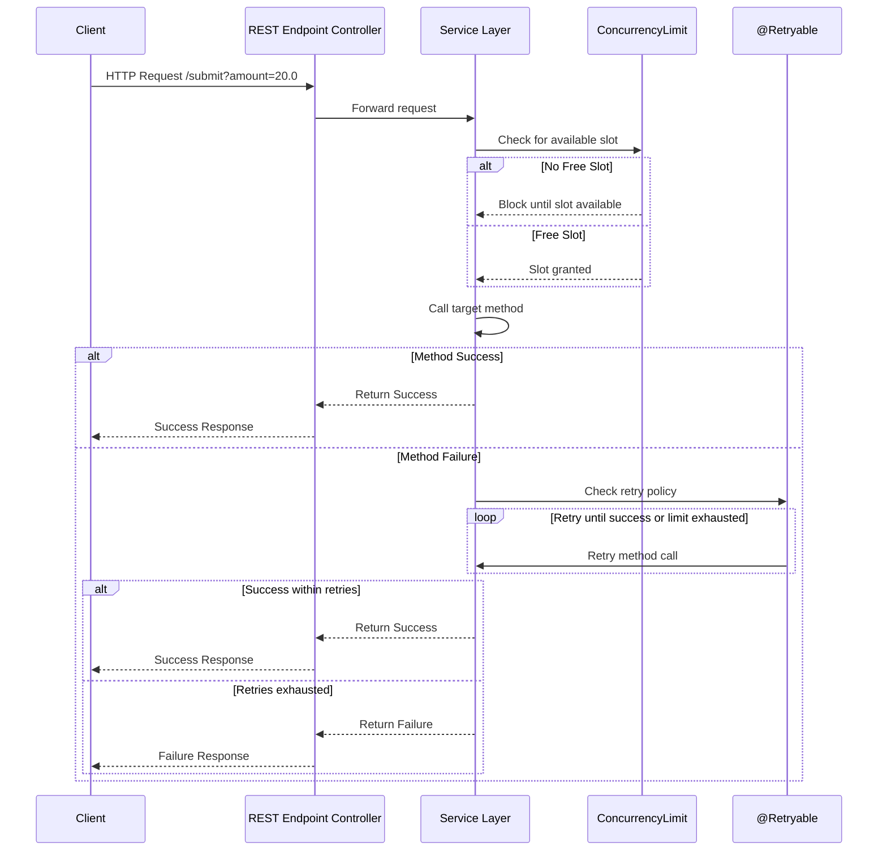

# Spring Boot 4.0 Resilience Demo

This project demonstrates the use of **Spring Boot 4.0 Resilience features** (such as retries and ConcurrencyLimit) in a simple REST-based application.

## Features
- Integration of Spring Boot 4.0 Resilience capabilities
- REST endpoint to test resilience functionality
- Example invocation with query parameters

## Requirements
- Java 25 (recommended)
- Gradle
- Spring Boot 4.0

## Running the Application
1. Clone the repository:
   ```bash
   git clone https://github.com/vamsigangarapu/spring-boot-resilience-demo.git
   cd spring-boot-resilience-demo
   ```
2. Build and run the application:
  ```./gradlew bootRun```
3. Access the REST endpoint:
  ```http://localhost:8080/submit?amount=20.0```

## Resilience Sequence Diagram


## Known Issues with Distributed Concurrency Control

While the flow chart shows the resilience logic, in real distributed systems there are challenges:

- Local limits don’t scale across multiple nodes.
- Blocking requests can cause latency and uneven load.
- Retry storms may overwhelm the system.
- Fairness in request handling is not guaranteed.
- Synchronizing state across nodes is difficult.
- Adds operational complexity in monitoring and debugging.

For more details, see [Building Distributed Concurrency Control in Spring](https://gae-piaz.medium.com/building-distributed-concurrency-control-in-spring-f14c1ed6403d).

---

## Best Practices & Mitigations

To address these issues, consider the following approaches:

- **Centralized Concurrency Control**  
  Use a distributed coordination mechanism (e.g., Redis, ZooKeeper, or database locks) to enforce limits across all service instances.

- **Exponential Backoff for Retries**  
  Configure `@Retryable` with backoff policies to avoid retry storms and reduce pressure on downstream services.

- **Timeouts & Circuit Breakers**  
  Combine concurrency limits with timeouts and circuit breakers to prevent blocked requests from hanging indefinitely.

- **Fair Queueing**  
  Implement fair scheduling or queueing strategies so blocked requests are resumed in a predictable order.

- **Monitoring & Metrics**  
  Track concurrency usage, retry counts, and blocked request durations with observability tools (Micrometer, Prometheus, Grafana).

- **Load Shedding**  
  In extreme overload scenarios, prefer graceful degradation (e.g., partial responses, cached data) instead of blocking all requests.

